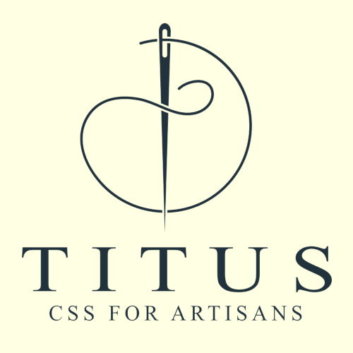

# Titus Visual Studio Code Companion



Titus Companion is a Visual Studio Code extension designed for CSS artisans who work with the Titus toolkit. This extension provides boilerplate code for Titus variables, making easier to implement CSS styles in your projects when using this toolkit.

Please visit the [Titus CLI](https://github.com/devluxor/titus-cli) repository for more details.

## Features

- **Quick Titus Variable Insertion:** Automatically inserts a pre-defined boilerplate code snippet when the user presses `Shift + F7`. This enables the developer to quickly type variable names from the Titus theming system.

### Requirements

- Visual Studio Code version 1.93 or higher.
- This extension is designed to work along the [Titus CLI](https://github.com/devluxor/titus-cli)

## Usage

First, generate the Titus CSS files via the Titus CLI you can find [here](https://github.com/devluxor/titus-cli). When the Titus CSS files are in the desired directory, import them from your own CSS files in the frontend project, and you'll be ready to enjoy this extension.

To use the Titus Companion:

1. Install the extension.
2. Open a CSS file in your project. This extension also works on SCSS and Less files.
3. Press `Shift + F7`.
4. The boilerplate code will be inserted at the cursor's current position, ready for you to easily enter the variable names from the Titus theming system.

You will notice the extension is active by the needle and thread icon to the right of the VS Code status bar:


## Variable codes

This is an example of how a Titus variable looks like:

```css
:root {

  --TITUS-srA: calc(1rem * 0.25);

}
```

Each Titus variable is formed by:

- The necessary double slash `--`
- A `TITUS` prefix to differentiate it from other variables
- A single slash `-` that separates the prefix from the *variable code*
- A variable code. In this example, it's `sr`, for **S**ize **R**elative. Each type of variable has its own code. For instance, `s` for absolute sizes (`--TITUS-sH`), or `mc` for the **M**ain app **C**olor
- An uppercase letter. In this example, `A`. This letter indicates the scale or intensity, where `A` is the minimum and `Z` the maximum. In the Titus color system, it refers to the lightness: letter `E` corresponds to the base color, `A` to the lightest tint, and `N` to the darkest shade.

## Quick Reference Table

| Category                | Variable Code | Example            |
|-------------------------|---------------|--------------------|
| General Absolute Sizes  | `s`           | `--TITUS-sA`       |
| General Relative Sizes  | `sr`          | `--TITUS-srA`      |
| Absolute Font Sizes     | `f`           | `--TITUS-fA`       |
| Relative Font Sizes     | `fr`          | `--TITUS-fr`       |
| Font Weights*           | `fw`          | `--TITUS-fwt`      |
| Main Color              | `mc`          | `--TITUS-mcA`      |
| Complementary Color     | `cc`          | `--TITUS-ccA`      |
| Accent Color #1         | `ac1`         | `--TITUS-ac1A`     |
| Accent Color #2         | `ac2`         | `--TITUS-ac2A`     |
| Accent Color #3         | `ac3`         | `--TITUS-ac3A`     |
| Accent Color #4         | `ac4`         | `--TITUS-ac4A`     |

*Font Weight Scale:

- `wt`: 100, Thin
- `wel`: 200, Extra Light
- `wl`: 300, Light
- `wn`: 400, Neutral
- `wm`: 500, Medium
- `wsb`: 600, Semi Bold
- `wb`: 700, Bold
- `web`: 800, Extra Bold
- `wbl`: 900, Black

## License

This project is licensed under the MIT License - see the [LICENSE](LICENSE) file for details.
